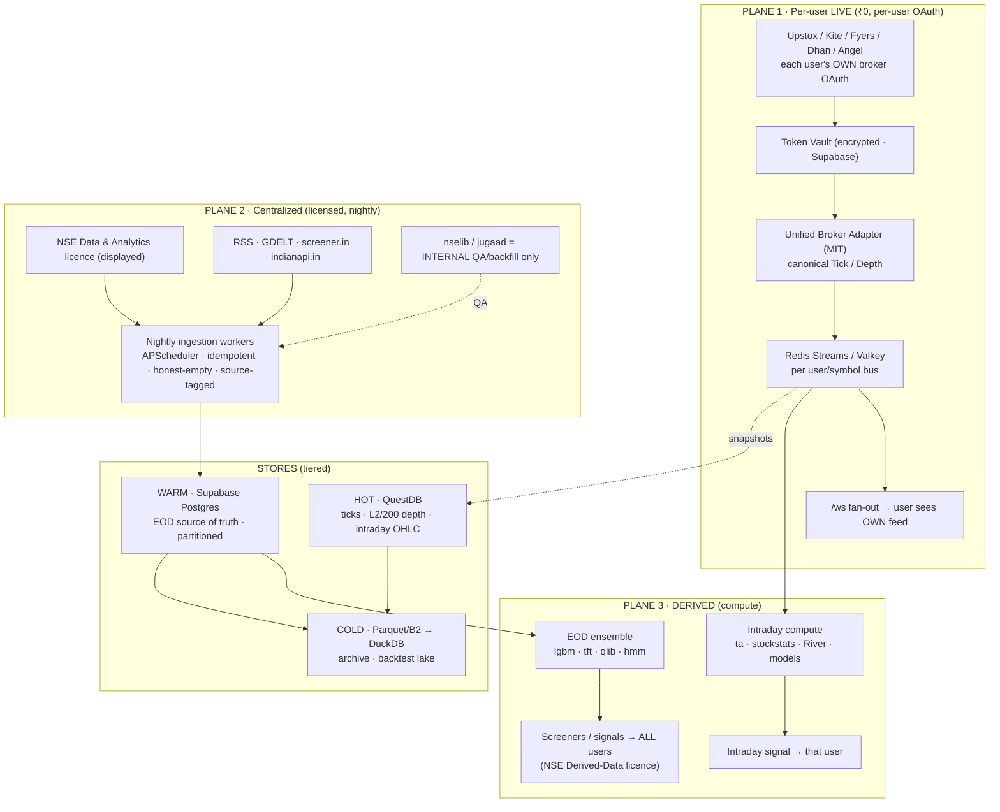

# Quant X — Data Pipeline & Foundation Design Spec

> **Status:** Approved design (brainstorming output). Next: `writing-plans` → per-phase TDD plans.
> **Date:** 2026-06-06 (rev 2026-06-07: licensing-first, no-degrade, 3-plane pipeline, BYO-broker stack)
> **Scope:** The end-to-end data pipeline for the whole app + the best-approachable foundation to build it. Phases F0–F7 + F-Legal.

**Goal:** A durable, honest, **license-correct** data pipeline that powers the full app — every data type from L1→L3 that is realistically obtainable — sourced via **one authoritative source per tier** (no quality-degrading fallback), persisted in a tiered store, and served two ways: **per-user live** (bring-your-own-broker OAuth, ₹0) and **centrally** (NSE-licensed) for screeners/signals shown to all users.

**Architecture (one line):** Three planes — **(1) per-user LIVE** (each user's broker OAuth → unified adapter → Redis bus → `/ws` + intraday signals), **(2) centralized EOD** (NSE-licensed nightly ingestion → Supabase source-of-truth), **(3) derived** (intraday + EOD signals) — over a tiered store (**QuestDB hot / Supabase warm / Parquet+DuckDB cold**), with honest-empty on any outage.

**Tech stack:** Python/FastAPI · Supabase Postgres · QuestDB (Apache-2.0) · Parquet+DuckDB (MIT) · Redis Streams/Valkey · APScheduler · broker MIT SDKs (`upstox-python`, `pykiteconnect`, `fyers-apiv3`, `DhanHQ-py`, `smartapi-python`) · `nselib` (internal QA only) · `ta`/`stockstats`/`River` · existing `yfinance`/`jugaad-data` (QA only).

---

## 1. Context — current state (audited + code-verified)

| Area | Reality today |
|---|---|
| Live provider | `DATA_PROVIDER` defaults to `"free"`→yfinance (no equity bid/ask, non-commercial ToS). [config.py:77](../../../backend/core/config.py#L77) |
| OHLC persistence | `candles` is a **write-only orphan** (only `cache_candles()` writes last-200 bars; nothing reads). [persistence.py:61](../../../backend/ai/signals/persistence.py#L61) |
| FII/DII | parquet cache, market-wide net only. [scheduler.py:3433](../../../backend/platform/scheduler.py#L3433) |
| Order flow | `nse_data.py` getters **in-memory only, none persisted**; `get_participant_oi` is aggregate (misnamed). [nse_data.py:88](../../../backend/data/screener/nse_data.py#L88) |
| L2 depth | Kite streams 5 levels; collector keeps only `levels[0]`. [collector.py:334](../../../backend/data/tick_collector/collector.py#L334) |
| Live infra (reusable) | `BrokerTickerManager` (per-user broker WS) + `ConnectionManager`/`/ws` already exist. |
| Deps | `yfinance`, `jugaad-data`, `nsepy` present; **`nselib`, broker SDKs (upstox/dhan/fyers) absent.** |

**Coverage today:** ~⅓ of needed data types are live, mostly ephemeral; the high-value layers (L2 depth, participant-OI, reference master, deep fundamentals) are missing or not persisted.

---

## 2. The data pipeline — 3 planes



**Why 3 planes:** they differ in source, **legality**, and lifecycle and must not be mixed. Plane 1 is each user's own feed (legal to show *them*, ₹0). Plane 2 is centrally-displayed NSE data (needs a licence). Plane 3 computes on both. Plane 1 (live) and Plane 2 (centralized) are **independent** — Plane 1 ships now with no licence; Plane 2 lights up when the NSE licence lands.

---

## 3. Source model — one authoritative source per tier (no degrade)

Every data type has **ONE** authoritative source + **honest-empty** on outage. `license` is the gate (the no-'mistake' rule): **OAuth** = per-user broker; **NSE-display / NSE-derived** = licensed central; **3rd-party** = external ToS; **QA-only** = internal backfill, never displayed.

| Data type | Layer | Authoritative source | License | Plane |
|---|---|---|---|---|
| LTP / bid-ask / qty / ATP / OI / circuit | L1 | user's broker (Upstox/Kite/Fyers/Dhan) | **OAuth** | 1 |
| Market depth 5/20/30/200-level | L2 | Upstox D30 / Kite-20 / **Dhan 200** | **OAuth** | 1 |
| Order-by-order TBT (F&O only) | L3 | **Fyers TBT 50-level (NFO)** | **OAuth** | 1 |
| L3 equity tick-by-tick | L3 | **none — NSE colo only** | — | — (§4) |
| Intraday OHLC (1–60m) | — | user's broker (live) / NSE feed (stored) | OAuth / NSE-display | 1/2 |
| Derived microstructure (OBI/OFI/VPIN) | — | in-house from L2 | NSE-derived | 3 |
| EOD OHLC + delivery | — | **NSE Data EOD-display** (nselib = QA only) | **NSE-display** | 2 |
| Order flow: participant-OI 4-way / FII-DII / bulk-block / short-sell / MWPL / SLB | — | **NSE Data** (nselib = QA only) | **NSE-display** | 2 |
| Derivatives EOD: chain OI/vol, futures, PCR, max-pain, IV pct/skew | — | NSE Data; **IV/greeks in-house** (`options_greeks.py`) | NSE-display / derived | 2/3 |
| Corporate actions / reference / instrument master | — | NSE Data corporate-data (nselib = QA) | **NSE-display** | 2 |
| Fundamentals (statements/ratios/shareholding/pledge) | — | **screener.in** (+ written commercial permission) | **3rd-party** | 2 |
| News + sentiment (+ GDELT historical) | — | RSS/GNews + GDELT; in-house FinBERT-India | 3rd-party / derived | 2/3 |
| Macro (VIX/indices/breadth/USDINR/yields) | — | NSE indices / yfinance(QA) / FRED | NSE-display / open | 2 |
| AI signals (intraday + EOD) | — | in-house models over licensed/OAuth data | **NSE-derived** | 3 |

**Hard rule:** `nselib` / `jugaad` / `yfinance` are **QA/backfill tooling only — never a displayed source** in a paid product (NSE ToS bans scraping for commercial display). The old `nselib→yfinance→jugaad` degrade chain is **removed**.

---

## 4. The L1→L3 reality (one true wall)

- **L1 — fully achievable, ₹0** via any broker OAuth.
- **L2 — fully achievable, ₹0→₹499** (Upstox 30 / Kite 20 free; **Dhan 200** at ₹499). 200-level = top-200 bid + top-200 ask aggregated price levels (deepest retail book) — still **aggregated (L2), not order-by-order**.
- **L3 — only for F&O** via **Fyers TBT 50-level DOM (NFO)**; **equity order-by-order TBT is NSE-colocation-only → infeasible for retail.** Closest equity substitute = approximate time-and-sales from LTP+LTQ snapshots. So "L1→L3" tops out at **deep L2 + NFO-TBT + approximate equity tape**.

---

## 5. Stores (one truth, three speeds) + schema

| Tier | Tech | Holds |
|---|---|---|
| **HOT** | QuestDB (defer until tick volume; interim Supabase) | intraday OHLC, L1 ticks, L2/200 depth snapshots |
| **WARM** | **Supabase Postgres** (source of truth, yearly native partitions, backend-only RLS) | daily OHLC, order-flow, participant-OI, derivatives EOD, corp-actions, reference, fundamentals, news, signals |
| **COLD** | Parquet on B2 → DuckDB | archive, backtest lake, GDELT, time-&-sales, aged hot |
+ `qlib .bin` = derived ML cache regenerated from WARM (never source of truth).

WARM tables: `instruments`, `index_constituents`, `corporate_actions`, `candles` (evolved orphan → partitioned daily store), `order_flow_eod`, `participant_oi_eod`, `bulk_block_deals`, `short_selling`, `fno_ban_mwpl`, `options_chain_eod`, `futures_eod`, `derivatives_metrics_eod`, `fundamentals_history`, `shareholding_pattern`, `events_filings`, `news_items` (+ existing `news_sentiment`), `index_macro_eod`. HOT (QuestDB): `quote_l1`, `depth_l2` (top-N arrays, snapshot-on-change), `ohlc_intraday`. Token vault: `broker_connections` (exists, extend: encrypted per-user tokens + refresh metadata).

Representative DDL (core; full set in the plan):
```sql
-- evolve orphan candles → partitioned daily store-of-record (composite PK matches existing cache_candles on-conflict)
ALTER TABLE public.candles RENAME TO candles_legacy;
CREATE TABLE public.candles (
  stock_symbol TEXT, exchange TEXT DEFAULT 'NSE', interval TEXT DEFAULT '1d',
  timestamp TIMESTAMPTZ, open NUMERIC, high NUMERIC, low NUMERIC, close NUMERIC,
  volume BIGINT, delivery_qty BIGINT, delivery_pct NUMERIC, adj_close NUMERIC,
  source TEXT DEFAULT 'nse', PRIMARY KEY (stock_symbol, interval, timestamp)
) PARTITION BY RANGE (timestamp);  -- yearly partitions; DROP candles_legacy after

CREATE TABLE public.participant_oi_eod (              -- the free 4-way split, built FORWARD (NSE has no backfill)
  date DATE, participant TEXT,                        -- client|pro|fii|dii
  fut_long BIGINT, fut_short BIGINT,
  opt_call_long BIGINT, opt_call_short BIGINT, opt_put_long BIGINT, opt_put_short BIGINT,
  source TEXT DEFAULT 'nse', PRIMARY KEY (date, participant)
) PARTITION BY RANGE (date);
```
```
QuestDB depth_l2(ts, symbol, levels, bid_px[], bid_qty[], bid_ord[], ask_px[], ask_qty[], ask_ord[])  timestamp(ts) PARTITION BY DAY
```

---

## 6. Plane 1 — the per-user LIVE stack (BYO-broker, ₹0, build first)

1. **Token Vault** — extend `broker_connections`: encrypted per-user broker tokens + refresh metadata. Daily refresh job (Upstox **1-year read-only token** avoids the daily-login tax; Kite/Dhan/Angel/Fyers refresh daily).
2. **Connection manager** — extend the existing `BrokerTickerManager` → multi-broker, multi-user per-user WS.
3. **Unified adapter** (`providers/unified.py`) — thin MIT layer over `upstox-python` (primary), `pykiteconnect`, `fyers-apiv3` (NFO L3), `DhanHQ-py` (200-depth), `smartapi-python` → canonical `Tick`/`Depth`. **Re-implement** OpenAlgo's pattern; never fork it (AGPL).
4. **Bus** — Redis Streams/Valkey, stream per user/symbol → decouples WS ingest from `/ws` fan-out + signal compute (backpressure + replay).
5. **Serve** — existing `ConnectionManager.broadcast` → `/ws` → user sees their own L1/L2(/L3-NFO).
6. **Intraday signals** — bus → `ta`/`stockstats` features + `River`/existing lgbm-tft → signal **for that user** (derived-for-them = cheap + legal).

License-clean SDKs: `upstox-python` (MIT), `pykiteconnect` (MIT), `fyers-apiv3` (MIT), `DhanHQ-py` (MIT). Avoid: OpenAlgo/OpenBull/backtesting.py (AGPL), fenix/backtrader (GPL), Shoonya (proprietary), vectorbt (Commons-Clause), pandas-ta (repo deleted → use `ta`).

---

## 7. Cross-cutting discipline (the "no-mistake" guarantees)

- **Single authoritative source per data type → honest-empty on outage** (`source="unavailable"`, never fabricate, never silent-downgrade). Quality + compliance in one rule.
- **Provenance** (`source` + `ingested_at`) on every row.
- **Idempotent + resumable** upserts on natural keys; partial-batch safety (count rows, log shortfalls — guards the 2026-05-19 partial-success bug).
- **Equal-grade redundancy** allowed ONLY on execution/quote-critical paths (a 2nd per-user broker OAuth) — not a free/scraped fallback.
- **License gates** enforced (per-user OAuth = live display; NSE licence = centralized display).

---

## 8. Phases (each = an implementation plan)

| Phase | Plane | Work package |
|---|---|---|
| **F0** | 2 | Reference + corporate-actions spine (`instruments`, `index_constituents`, `corporate_actions`) |
| **F1** | 2 | WARM EOD OHLC store (evolve `candles`) + CA-adjusted backfill (active universe × 5yr) + read-through `get_historical` |
| **F2** | 2 | Order-flow EOD (`order_flow_eod`, `participant_oi_eod`, bulk/block, short-sell, ban/MWPL) + nightly archiver (build-forward) |
| **F3** | 2/3 | Derivatives EOD (chain OI/vol, futures, PCR/max-pain/IV; greeks in-house) |
| **F4** | 2 | Fundamentals + events/filings (screener.in + pledge/shareholding + SAST/insider/ratings) |
| **F5** | 2/3 | News + sentiment (forward RSS/GNews + GDELT historical; FinBERT-India) |
| **F6** | 1 | **Per-user LIVE plane** — token vault + `BrokerTickerManager` multi-broker + unified adapter (Upstox+Kite first) + Redis bus + `/ws` + intraday signals |
| **F7** | 1/3 | Hot/cold tiers (QuestDB + Parquet/B2→DuckDB) + derived microstructure (OBI/OFI) + Fyers NFO-TBT + Dhan 200-depth |
| **F-Legal** | 2 | **Blocking gate:** sign NSE EOD-display + Non-Display/Derived agreement; screener.in commercial permission. **No centralized NSE data displayed to paying users until signed.** (Plane 1 / F6 is independent of this.) |

**Build order:** F6 (Plane 1, ₹0, no licence) can start **now** in parallel with F0→F2 (Plane 2 internal groundwork). Centralized *display* (F0–F5 surfaces) goes live only after F-Legal.

---

## 9. Codebase mapping (build, don't greenfield)

| Build/modify | What |
|---|---|
| `data/providers/` | + `upstox_source.py`, `dhan_source.py`, `fyers_source.py`, `nselib_source.py`, `unified.py`; keep `kite.py`/`yfinance.py` |
| `BrokerTickerManager` | extend → multi-broker, multi-user, token-vault-driven |
| `core` (new) | Redis Streams/Valkey bus between WS ingest ↔ `/ws` ↔ signal compute |
| `data/market.py` | `get_historical` read-through WARM store ([market.py:286](../../../backend/data/market.py#L286)) |
| `platform/scheduler.py` | extend EOD crons (`order_flow_daily_catchup`, EOD backfill, reference, fundamentals, news) |
| Supabase | new tables (§5) via `infrastructure/database/migrations/2026_06_06_pr_data_foundation.sql` (+ per-phase) |
| `screener/nse_data.py` | store-first reads (WARM) |
| `requirements.txt` | `nselib`, `upstox-python`, `dhanhq`, `fyers-apiv3`, `redis`, `questdb`/`duckdb` (later phases) |

---

## 10. Decisions locked

1. **3-plane pipeline:** per-user LIVE (OAuth) + centralized (NSE-licensed) + derived. Planes 1 & 2 independent.
2. **No quality-degrading fallback** — single authoritative source per tier + honest-empty. `nselib`/`jugaad`/`yfinance` = QA/backfill only, never displayed.
3. **Live display = per-user broker OAuth** (Upstox primary for 1-yr token, + Kite/Fyers/Dhan/Angel) — honors the 2026-04-18 OAuth lock; **no shared admin feed displayed to users.**
4. **Centralized display = NSE Data & Analytics licence** (EOD-display + Non-Display/Derived for AI signals) — gated by F-Legal.
5. **Durable store = Supabase WARM (truth) + QuestDB HOT + Parquet/B2→DuckDB COLD.** Evolve `candles`; backfill active×5yr.
6. **L3:** equity TBT out (colo-only); **Fyers NFO-TBT** is the only retail L3 (F7). Dhan **200-depth** for deep L2 (F7, focused symbols).
7. **Options IV/greeks** in-house (`options_greeks.py`); Dhan-direct when on its feed.
8. **AI signals = Derived Data** under NSE Non-Display Policy → require the Non-Display agreement before serving centrally.

---

## 11. Cost

| Item | Cost | Notes |
|---|---|---|
| Plane-1 live (per-user OAuth) | **₹0** | each user's own broker; Upstox/Angel free, Dhan ₹499 if user wants 200-depth |
| Your own Dhan (200-depth research) | ₹499/mo | optional, internal |
| `indianapi.in` (free-tier/fundamentals centralized) | cheap sub | ToS commercial-OK; confirm redistribution in writing |
| NSE EOD-display licence | ~₹1.1L/yr per medium | **confirm exact terms with NSE** (pending) |
| NSE Non-Display/Derived | negotiated | for serving AI signals; **confirm** |
| QuestDB hosting (F7) | ~₹600–1,200/mo | defer until tick volume |

**Lean launch:** Plane 1 (₹0) + `indianapi.in` (cheap) ships a real product now; the NSE licence (~₹17.5k+/mo) is added when centralized NSE display to all users becomes the bottleneck.

---

## 12. Testing (TDD)

- **Unit:** broker-SDK adapters → canonical Tick/Depth; nselib parsers (participant-OI 4-way, depth, corp-actions); partition routing; read-through hit/miss; honest-empty mapping; license-tag enforcement.
- **Integration:** each EOD cron writes real rows; `get_historical` read-through + backfill on miss; per-user WS → bus → `/ws` round-trip; depth snapshot ≥5 levels; honest-empty asserts **no fabricated rows**.
- **Migration:** partitioned `candles` rebuild + new tables apply cleanly + re-runnably; backend-only grants revoked.
- **No-regression:** existing `cache_candles()` + FII/DII parquet dual-write still work.

## 13. Risks

NSE bot-blocking on QA backfill (maintained libs, bounded concurrency, resumable) · broker token-refresh churn (Upstox 1-yr token mitigates; daily refresh job for others) · **licensing risk** — displaying NSE data before F-Legal = ToS/IP breach with audit/cutoff exposure (gated) · per-user OAuth coverage gap (non-connected users get honest-empty live, by design) · 200-depth bandwidth (focused symbols only) · QuestDB ops (deferred to F7) · `nselib`/SDK API drift (pin versions, parser unit tests).

## 14. Open / pending

- **NSE exact terms** (EOD-display + Non-Display/Derived pricing & scope) — confirm with `marketdata@nse.co.in` before F-Legal. ₹ figures above are research estimates, not legal advice.
- **screener.in commercial-use permission.**
- **Standing:** rotate exposed OpenRouter key; never commit `.env` / `competitor-research/` / `ClientAuthGate` dev bypass.
